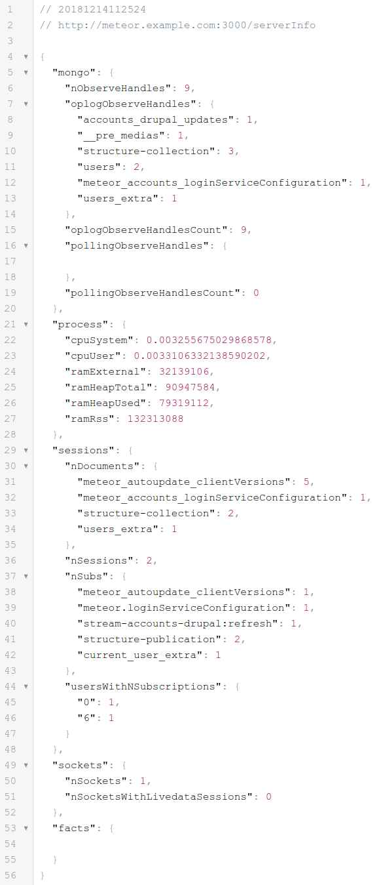

# Meteor server info

- A NPM version (derivative work) of [percolate:server-info]
- Rewritten in TypeScript 3 for Meteor 1.6-1.8.1
- Without the AWS-specific and extra sections, not relevant for most usages.
- With 3 original Node.JS EventLoop metrics collectors (see "Configuration")

[](https://travis-ci.org/fgm/meteor_server_info)
[](https://codecov.io/gh/fgm/meteor_server_info)
[](https://snyk.io/test/github/fgm/meteor_server_info?targetFile=package.json)
[](https://app.fossa.io/projects/git%2Bgithub.com%2Ffgm%2Fmeteor_server_info?ref=badge_shield)

## Usage

Once installed and configured, the package provides

- a public metrics documentation route, available by default on
  `/serverInfo/doc` where all exposed metrics are documented
- a metrics values route available with HTTP Basic authentication, by
  default on `/serverInfo`, like the following one:




## Installation

- Like the original version, this project needs the MDG [Facts] package, but not
the `facts-ui`package. So from the project directory, add both dependencies:
```
meteor add facts
meteor yarn add meteor_server_info
```
- Then, in the main JS file of the server part of the application, add code to
  initialize the package:

```
import { ServerInfo } from "meteor_server_info";

Meteor.startup(function () {
  const serverInfo = new ServerInfo(Meteor, WebApp, MongoInternals, Facts);
  serverInfo.register();
});
```

- Edit the Meteor settings, at least to change the user and password.
- Run your application normally.

### Development installation

To work on the package, you will probably not want to use it via NPM/Yarn. In
that case:

- do NOT add it to your `package.json`
- clone it in the `import/server/` directory of your project,
- import its dependencies with `meteor yarn`
- build documentation with `yarn && yarn doc`. The documentation will be built
  in the `out/` directory.
- compile with `meteor yarn ts-compile`, lint with `meteor yarn ts-lint` and
  run tests with `meteor yarn test-ci`

To use your development version of the module, import it locally in your
application code. You will have access to `serverInfo` from `meteor shell`.

```
// Heed the "./" import.
import { ServerInfo } from "./meteor_server_info";

Meteor.startup(function () {
  const serverInfo = new ServerInfo(Meteor, WebApp, MongoInternals, Facts);
  serverInfo.register();
  global.serverInfo = serverInfo;
});
```

That way, any time you recompile the module, you application will notice the JS
changes and rebuild/restart itself.


## Configuration

The packages takes configuration from `Meteor.settings`, in which it uses the
following server keys:

- `path`: the path on which the information is made available. Defaults to
  `/serverInfo`, unlike the original version which defaulted to `/info`.
- `user`: the user account for the HTTP Basic authentication securing access.
  Defaults to `insecure`.
- `pass`: the password for the user account. Defaults to `secureme`.
- `verbose`: enable console logging. Defaults to `false`.
- `eventLoopStrategy`: the strategy to use to instrument the event loop and/or
  statistical CPU usage
  - `"els"`: a set of event-loop metrics provided by the [event-loop-stats]
    package. Cheap and accurate, this is the recommended collector. 
  - `"nr"`: inspired by NewRelic "CPU time per tick", an intuitive metric
    collecting instantaneous CPU usage across ticks, based on a [Dynatrace article], 
    tracing each tick of the event loop in JavaScript code, which makes it
    rather costly since it disables the event loop "poll phase wait" optimization
    to achieve accuracy: expect 8% CPU load. 
  - `false`, the event loop metrics collection is disabled, to keep costs at an
    absolute minimum like the legacy `MeteorServerInfo`.

The package previously included a "cheap" collector based on the [PM2] / [pebble/event-loop-lag]
logic, but this has been superseded by the ELS collector. 

[event-loop-stats]: https://www.npmjs.com/package/event-loop-stats
[pebble/event-loop-lag]: https://github.com/pebble/event-loop-lag
[percolate:server-info]: https://atmospherejs.com/percolate/server-info
[PM2]: https://github.com/keymetrics/pmx/blob/1.3/lib/default_probes/pacemaker.js
[Facts]: https://atmospherejs.com/meteor/facts
[screenshot]: screenshot-todos.png
[Dynatrace article]: https://medium.com/the-node-js-collection/what-you-should-know-to-really-understand-the-node-js-event-loop-and-its-metrics-c4907b19da4c


## Usage note

Metrics exposed by the module can easily be imported to Grafana using the `http`
plugin and a Telegraf import. Be sure to import data from all your Meteor server
instances, since metrics are reported per-server, not per-database.

Note that since the `nr` collector disables the event loop poll phase wait
optimization, the idle ticks/second rate will be around 900 and go lower with
increased load. There is a tradeoff to be done: CPU cost vs accuracy.

The high cost of this strategy is a consequence of the limitations of the
Node.JS event loop JavaScript API, requiring workarounds. For accurate metrics
with lower metric acquisition cost, a binary agent is required, like the ELS
collector, or commercial offerings: AppDynamics, Dynatrace, NewRelic and others
offer this type of solution, the tradeoff in that case being CPU cost vs monthly
SaaS cost.


## License

As the original [percolate:server-info] package was licensed under the
permissive MIT license, this derivative work has been relicensed under the
General Public License version 3 or later (SPDX: GPL-3.0+).


[](https://app.fossa.io/projects/git%2Bgithub.com%2Ffgm%2Fmeteor_server_info?ref=badge_large)

## Changelog

* 1.2.6
  * ElsCounter now includes a LoopCountPerSecondSinceLastFetch building an average
    between fetches, and reset on each fetch.
  * BC break: Removed CheapCounter and CostlyCounter, entirely superseded by ElsCounter
  * Garbage collection now uses gc-stats 1.4.0 stable version.
  * tickLagMax renamed to loopLagMaxMsecSinceLastFetch
  * New `doc/NodeCounters.md` detailing the rationale for the changes since 1.2.5.
  * TypeScript 3.5, Node 12 types, other minor dependency updates.
* 1.2.5
  * Native event loop metrics from package [event-loop-stats](https://github.com/bripkens/event-loop-stats)
    as a more efficient alternative to CostlyCounter and NrCounter.
  * As a consequence, those are now deprecated and will be removed no later than
    version 1.3.
  * CheapCounter metrics now return a high-resolution duration instead of a struct.
  * Dev API: interface ICounter removed,
* 1.2.4
  * Same as 1.2.3, but also working on Meteor 1.8.1
  * Session info are no longer null on Meteor 1.8.1
  * Socket metrics also work in `meteor run` mode on Meteor 1.8.1 
* 1.2.3
  * New garbage collector metrics from package [gc-stats](https://github.com/dainis/node-gcstats).
  * TypeScript 3.4.
* 1.2.2
  * New tickLagMax in NrCounter. Other metrics renamed and reworded for intelligibility.
  * TypeScript 3.3.
  * Over 70% new test coverage for NrCounter and CounterBase.
* 1.2.1
  * Node.JS EventLoop and CPU metrics, 3 strategies at different accuracy and cost levels
  * TypeScript 3.2.
  * Documentation converted from Jsdoc to Typedoc.
  * 100% test coverage of NodeInfo and SessionInfo.
* 1.2.0
  * Converted to TypeScript 3, with increased coverage
  * Compatibility with Meteor 1.7 and 1.8.
* 1.1.2
  * updated documentation.
  * Travis CI tests.
  * CodeCov coverage analysis.
* 1.1.1
  * include RAM / CPU metrics.
* 1.0.1
  * added an explicit dev dependency on marked 0.3.9 to work around
    https://github.com/jsdoc3/jsdoc/issues/1489 - can be removed once jsdoc
    updates its dependency to that level.
  * updated JsDoc to 3.5.5.
  * fixed JsDoc configuration so that npm run doc actually works
* 1.0.0: initial version
  * For Meteor 1.6.x