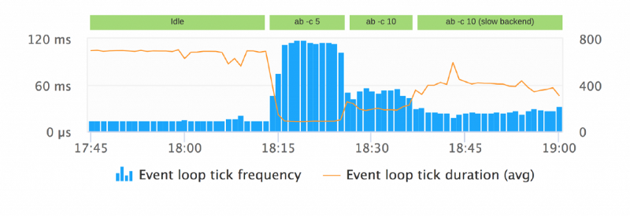
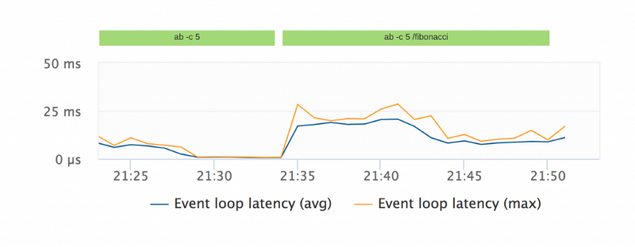

# AppDynamics

- https://docs.appdynamics.com/display/PRO42/Node.js+Metrics#Node.jsMetrics-EventLoopMetrics
- "Average I/O time": avg msec per loop spend on I/O callbacks
- "Average tick length": avg time between two ticks
- "Maximum tick length": longest time between two ticks (AppDynamics does claims the shortest)
- "Minimum tick length": shortest time between two ticks (AppDynamics does claims the longest)
- "Tick Count": number of times the event loop was ticked

# PM2

- "Event loop latency": a histogram()-decaying trend of the time between to iterations 
  of a setInterval(fn, 1000), assuming 1000 ticks occurred
  - very cheap
  - very inaccurate: most of the time the actual number of ticks, at least as
    visible from JS, is significantly lower than 1000
  - Example:
    - idle process: 887, 884, 996, 918, 918, 913, 917, 923, 922, 913, 917, 918
    - reading a 1 GB file: 891, 892, 542    

# Dynatrace

- https://medium.com/the-node-js-collection/what-you-should-know-to-really-understand-the-node-js-event-loop-and-its-metrics-c4907b19da4c
- "There is no API to fetch runtime metrics from the event loop and as such each monitoring tool provides their own metrics"
- "Tick frequency": number of ticks per (unit of) time (apparently 10 sec)
- "Tick duration": the time one tick takes (possible because native agent)



Shows that:

- when idling, Node keeps a longer wait (in the polling phase), around 100 msec 
  (100 ticks/10 sec)
- under a higher load, I/O being performed stops the wait, and the loop goes down
  to about 15 msec (700 ticks/10 sec)
- at an even higher load, I/O can no longer be entirely performed without impact,
  and the loop takes about 30 msec (350 ticks/10 sec)
- with high load and a slow backend, where requests accumulate, Node increases the
  loop latency (60 msec) and reduces the frequency (150 ticks/10 sec)
- Conclusion: idle metrics look a lot like high load with a slow backend, the 
  difference will be in memory usage.  
The TF*TD product appears essentially constant within rounding errors.
  

- Work processed latency: time until an asynchronous task gets processed by the 
  thread pool. Is about async work, not the event loop proper
- Event loop latency: actual vs expected delay on setTimeout() calls.



Closed source means the logic used for these cannot be verified. Loop latency is
very similar to the PM2 metric.

# Debugging notes

Locate open handles when Jest complains:

```typescript
import "process";
let timers = (process as any)._getActiveHandles().map((handle: any) => {
  return handle.constructor;
});
console.log(timers);
```
